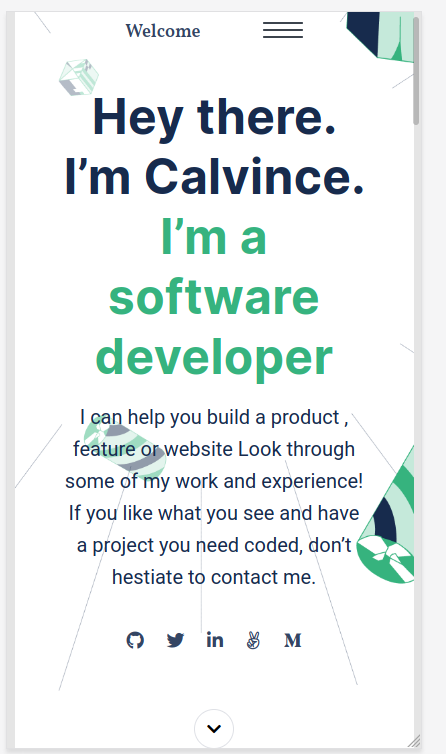

# Project Name

This is project creates resume. It contain all the projects I hav worked on as a individual developer and as a collaborator and contrubutor

## Built With

- HTML5 and CSS3

## Getting Started

To get a local copy up and running follow these simple example steps.

### Prerequisites
- web browser of choice is installed and configured

### Usage
 - This is a sample or test web application, with limited or no functionality

### Deployment
 - open the index.html page using any browser (preferably - firefox, googlechrome, safari)

## Authors

👤 **Calvince**

- GitHub: [@githubhandle](https://github.com/calvnce)
- Twitter: [@twitterhandle](https://twitter.com/sir_coly)
- LinkedIn: [LinkedIn](https://linkedin.com/in/sir_coly)

## Show your support

Give a ⭐️ if you like this project!

## Acknowledgments

- Hat tip to anyone who helped complete the project

## 📝 License

This project is [MIT](LICENSE) licensed.